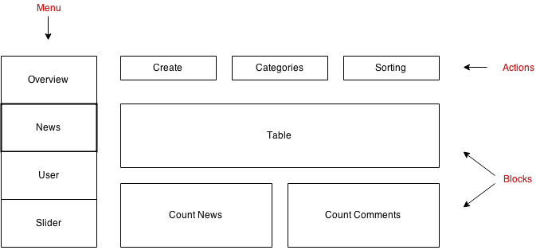

App Route
=========

Before you use the app route, you should know what we understand under ``actions`` and ``blocks``.
The app route is responsible to display these to kinds of abstraction. It is fully independent on any
data model. On this Picture you can see how the app route could render them.

Actions
-------

Actions are something like buttons. If you click on these buttons, there will be executed something.
Normally just an overlay will be displayed. The overlay will provide a form, where the user can change
data.

Blocks
------

A block is small unit with its own logic. It could also provide some clickable events. But the focus is
to presented some information.

Route
-----

Here is an example route

.. code-block:: yaml

    enhavo_app_index:
        path: /enhavo/app/index
        methods: [GET]
        defaults:
            _controller: enhavo_admin.controller.resource:indexAction
            _sylius:
                template: enhavoAppBundle:App:index.html.twig
            _viewer:
                type: app
                parameters:
                    name: value
                blocks:
                    table:
                        type: enhavo_page_page_table
                        parameters:
                            table_route: enhavo_page_page_table
                            update_route: enhavo_page_page_update
                actions:
                    create:
                        type: overlay
                        route: enhavo_page_page_create
                        icon: plus
                        label: label.create
